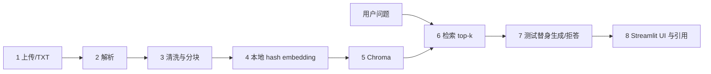

# Day 1 架构与数据流

## 基线 8 环节

## 源文件映射

| 环节 | 文件 | 入口 |
| --- | --- | --- |
| 上传/读取 | `app/ingestion/loaders.py` | `load_txt` |
| 清洗 | `app/ingestion/cleaner.py` | `clean_text` |
| 分块 | `app/ingestion/splitter.py` | `split_text` |
| embedding | `app/retrieval/vector_store.py` | `hash_embedding` |
| Chroma 入库 | `app/retrieval/vector_store.py` | `LocalChromaStore.upsert` |
| 检索 | `app/retrieval/retriever.py` | `retrieve` |
| 生成/拒答 | `app/services/qa_service.py` | `answer_question` |
| UI/引用 | `ui/streamlit_app.py` | Streamlit 页面 |

## 当前职责边界

- 已有：通用 TXT 基线、Chroma、测试替身和问答引用。
- 准备复用：Day 1 的配置、分层目录、请求响应契约和 Chroma 封装。
- 后续按天增加：Day 2 PDF 与制造文档、Day 3 SQLite、Day 4 诊断、Day 5 API/日志、Day 6 评测；当前不保留空壳文件。

## 核心原理

1. **分块与 overlap**：长文档不能整体参与检索。相邻块保留少量重叠，可减少答案横跨边界时的丢失；重叠过大也会制造重复噪声。
2. **稳定 chunk ID**：ID 由文档 ID 和块序号组成。同一文档重复入库时使用 Chroma `upsert` 覆盖同一条记录，避免静默累积副本。
3. **embedding 与距离**：Day 1 用稳定 hash 将相同词元映射到相同向量维度，再用余弦距离比较；距离越小通常越相关。它只匹配表面词元，不理解同义词。
4. **可追溯引用**：`source_file`、`chunk_id` 和文本范围在入库时与内容绑定。回答阶段直接读取这些 metadata，来源不交给生成模型编写。
5. **grounded 的边界**：当前只有“集合无结果”拒答。相关性阈值必须在 Day 2/Day 6 用固定问题评测后确定，因此现在不能把任意命中称为可靠证据。

## 冻结契约

- 问答请求：`question`、可选 `equipment_id`、`top_k`。
- 问答响应：`answer`、`citations[]`、`grounded`、`request_id`。
- 诊断请求/响应：见 `app/schemas/diagnosis.py`。
- 错误码：`INPUT_INVALID`、`EQUIPMENT_NOT_FOUND`、`EVIDENCE_NOT_FOUND`、`VECTOR_STORE_ERROR`、`DATABASE_ERROR`、`MODEL_ERROR`；等 API 层实现时再写代码。
