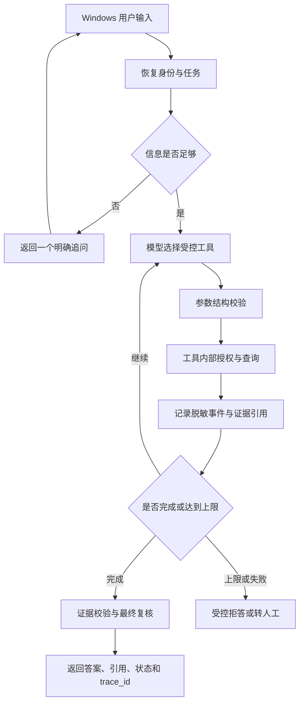

# Agent 核心能力升级计划

状态：待实施。依据 2026-09-22 当前源码制定，不把计划项写成已完成功能。

## 1. 目标与范围

在现有受控 RAG、固定多源诊断、权限和证据校验基础上，依次补齐：

1. 模型自主选择只读工具并完成有界循环。
2. 信息不足时追问，保存任务状态并继续执行。
3. 记录可审计、可展示的执行事件。
4. 用固定数据集比较当前流程和新 Agent 的效果、成本与失败类型。
5. Windows 页面支持 local 与真实模型模式，并展示任务与执行过程。

当前不实施多 Agent、OCR、MCP、设备控制、任意 SQL、自动维修操作和云端部署。多 Agent 仅在单 Agent 评测证明存在明确瓶颈后立项。

## 2. 现有基线

| 能力 | 当前事实 | 本计划处理 |
| --- | --- | --- |
| 文档问答 | 授权检索、距离门控、引用与最终复核 | 封装为知识检索工具 |
| 业务数据 | 设备、报警、维修记录的受限只读查询 | 封装为三个业务工具 |
| 诊断 | 服务端按固定顺序查询三类证据 | 保留作基线，不直接删除 |
| 模型 | DeepSeek 选择证据或建议编号 | 增加原生 tool calls 循环 |
| 状态 | 登录会话，无多轮任务状态 | 增加独立任务存储 |
| 追踪 | request_id 和部分问答 trace | 增加统一事件模型 |
| 评测 | 问答样例、自动测试和验收脚本 | 增加 Agent 专项数据集与报告 |
| Windows | 请求固定为 local | 增加模式选择、任务继续和轨迹视图 |

所有新增链路必须复用现有授权、外发许可、证据编号和返回前复核。模型不得直接访问数据库、向量库、文件路径、令牌或权限表。

## 3. 目标执行流

## 4. 阶段 A：冻结基线和契约

### 实施内容

- 保留 `/api/v1/ask` 与 `/api/v1/diagnose`，作为回归和效果对照。
- 新增版本化 Agent 契约，不在旧端点中塞入多轮状态。
- 定义 `AgentRunRequest`、`AgentRunResponse`、`AgentTask`、`AgentEvent` 和统一错误码。
- 固定 local 的含义：确定性规则与现有工作流；它不是本地大模型。
- 固定 deepseek 的含义：服务端真实模型及原生工具调用；客户端不持有模型密钥。

### 建议接口

| 接口 | 用途 |
| --- | --- |
| `POST /api/v1/agent/tasks` | 创建任务并执行到答案、追问或受控停止 |
| `POST /api/v1/agent/tasks/{task_id}/turns` | 提交追问答案并继续 |
| `GET /api/v1/agent/tasks/{task_id}` | 获取当前任务状态和最终结果 |
| `GET /api/v1/agent/tasks/{task_id}/events` | 获取当前用户可见的脱敏轨迹 |
| `POST /api/v1/agent/tasks/{task_id}/cancel` | 取消未结束任务 |

### 退出标准

- 新旧响应契约互不混用。
- 非任务所有者读取或继续任务统一拒绝。
- 契约测试覆盖正常、追问、拒答、取消、过期和错误输入。

## 5. 阶段 B：自主工具调用

### 第一批工具

| 工具 | 复用实现 | 允许输入 | 返回重点 |
| --- | --- | --- | --- |
| `get_equipment` | `ProtectedMaintenance.query` | `equipment_id` | 授权设备事实 |
| `list_alarms` | `ProtectedMaintenance.query` | 设备、数量、级别、时间范围 | 报警 ID、时间、状态和关联文档 |
| `list_maintenance` | `ProtectedMaintenance.query` | 设备、数量、时间范围 | 历史记录及“不是当前许可”标记 |
| `search_knowledge` | `authorized_answer` 的检索与证据层 | 问题、设备、top_k | 证据 ID、原文、版本和距离 |

### 执行规则

- 工具参数使用 Pydantic 严格结构，拒绝额外字段。
- Agent Runner 只持有工具注册表，不允许模型指定 Python 名、URL、SQL 或文件路径。
- 每次运行限制模型轮数、工具总数、单工具结果条数、响应体积和总超时。
- 工具始终接收服务端恢复的 token/用户上下文，模型不能传入身份。
- deepseek 调用前检查所有外发数据；只读权限不等于允许外发。
- 工具返回结构化事实和证据引用，不直接把内部异常、路径或完整策略发给模型。
- 模型结束后仍执行证据归属、原文、版本、身份与策略复核。
- 模型超时、未知工具、非法参数、循环超限统一进入受控错误，不自动改用 local。

### 最小实现建议

先沿用当前标准库 HTTP 调用和 Pydantic，不为第一版引入 Agent 框架。只有当状态恢复或事件编排代码出现可测的复杂度问题时，再比较 LangGraph 等方案。

### 退出标准

- 模型能根据四类固定问题选择正确工具和合法参数。
- 未授权设备、记录和文档不会进入模型输入或最终响应。
- 任意 SQL、写操作、未知工具和超过上限的调用均被拒绝。
- 现有问答、诊断与权限回归继续通过。

## 6. 阶段 C：多轮追问与任务状态

### 状态模型

使用独立 SQLite 文件保存任务，不把对话状态塞进登录会话。最少包含：

- `task_id`、所有者、mode、status、version。
- 当前设备、现象、时间范围和已确认约束。
- 缺失字段、已调用工具、证据引用、调用计数。
- 创建、更新时间和过期时间。
- 最终回答、引用或停止原因。

正文只保存完成任务所需的最小内容；凭证、模型密钥、权限快照和完整隐藏提示词不得入库。任务和事件设置保留期限，过期任务不能继续。

### 追问规则

- 每轮最多返回一个高价值问题。
- 能从当前任务确定的信息不重复询问。
- 设备不明确时先确认设备；时间范围只在问题确实依赖历史时追问。
- 用户回答与已有状态冲突时明确要求重新确认，不静默覆盖。
- 权限或策略变化后重新授权；旧证据不能因已存入任务而继续可见。
- `human_review` 增加明确的暂停原因，但第一版不执行审批后的写操作。

### 退出标准

- “设备不明 → 追问 → 补充设备 → 查询 → 返回证据”可跨 HTTP 请求完成。
- 重复提交同一 turn 不产生重复工具副作用或重复事件。
- 退出、禁用、撤权、任务过期和取消后不能继续。
- 两个用户不能读取、猜测或接管彼此任务。

## 7. 阶段 D：完整执行追踪

### 事件模型

按单调序号记录：`run_started`、`follow_up_requested`、`model_requested`、`tool_selected`、`tool_started`、`tool_succeeded`、`tool_failed`、`state_updated`、`answer_validated`、`run_stopped`。

每条事件保存 task/trace/request ID、事件类型、时间、耗时、结果状态和必要的脱敏元数据。工具参数仅保留允许展示的字段；文档正文、密码、token、模型密钥、本地路径和内部异常不得写入事件。

若供应商响应包含 token usage，则记录输入、输出 token 与模型名；费用需要明确的价格快照和日期，没有权威价格时只记录 token，不估算金额。

### Windows 展示

- 默认展示用户能理解的步骤名称、耗时和结果。
- 技术详情折叠显示 trace_id、工具名和受控参数。
- 不展示隐藏提示词、权限规则全文或其他用户数据。
- 失败步骤说明可重试、补充信息或联系人工，不能只显示原始异常。

### 退出标准

- 任一任务能按 trace_id 重建执行顺序。
- 轨迹与最终答案使用同一任务和证据版本。
- 脱敏测试覆盖密钥、token、密码、正文、路径及模型错误。

## 8. 阶段 E：系统化评测

### 数据集分组

| 分组 | 重点 |
| --- | --- |
| 单工具 | 设备、报警、维修、知识分别选择正确工具 |
| 多工具 | 需要两种以上来源后才能完成 |
| 追问 | 缺设备、症状或必要时间范围 |
| 证据 | 引用存在、原文匹配、版本有效、资料不足时拒答 |
| 权限 | 跨部门、密级不足、禁止外发、在途撤权 |
| 鲁棒性 | 模型超时、非法 JSON、未知工具、参数越界、重复调用 |
| 对抗 | 提示注入、要求执行 SQL、绕过权限、伪造身份或证据 ID |

评测资料继续使用可公开的模拟数据。每条用例保存输入、初始任务状态、允许/禁止工具、预期状态、必须/禁止证据和安全断言。

### 指标

- 任务完成率和追问正确率。
- 工具选择准确率、参数有效率和不必要工具调用数。
- 引用有效率、拒答正确率和权限泄漏数。
- 总轮数、工具数、端到端耗时、模型 token 数。
- 失败原因分布：检索、模型、工具、权限、状态和输出校验。

安全目标为固定集中的越权泄漏、非法写操作和伪造引用均为 0。其余通过阈值先作为待确认目标，必须基于首轮基线结果再冻结，不能预写成已达到。

### 输出物

- `data/eval/agent_cases.jsonl`：版本化用例。
- `scripts/run_agent_eval.py`：可重复运行 local 基线与 deepseek Agent。
- `data/results/agent-eval-*.json`：原始机器结果，本地敏感运行记录不上传。
- `docs/agent-evaluation.md`：数据集版本、环境、指标、失败案例与改进结论。

### 退出标准

- 同一数据集能比较固定工作流和自主 Agent。
- 报告区分通过、失败、跳过和未运行。
- 在线评测记录模型、日期、样本数、token 和失败数。
- 任一安全断言失败都阻断发布。

## 9. 阶段 F：Windows 闭环

### 页面改动

- 增加 local／真实模型选择，并持续显示当前模式。
- local 调用现有确定性问答/诊断；真实模型调用新 Agent 任务接口。
- 增加追问卡片、继续按钮、取消任务和任务过期提示。
- 增加执行步骤时间线与引用重查。
- 切换账号、服务器或模式时清理旧任务视图；在途旧响应不能回填。
- 服务端真实模型失败时显示明确失败，不静默切到 local。

### 退出标准

- Windows 完成登录、两种模式、追问继续、取消、引用重查和轨迹查看。
- 模型密钥不进入客户端、日志或安装包。
- 键盘、窗口缩放、断网、超时、后台恢复和重复点击有明确行为。
- `flutter analyze`、`flutter test`、网络层自检和 Windows release 构建通过；实际运行另留截图或操作记录。

## 10. 实施顺序与提交边界

| 顺序 | 建议提交 | 必须先通过 |
| --- | --- | --- |
| 1 | Agent 契约与任务表 | schema、所有权和迁移测试 |
| 2 | 四个只读工具适配器 | 现有权限与数据测试 |
| 3 | DeepSeek 工具循环 | 工具选择、上限和异常测试 |
| 4 | 多轮追问与恢复 | 任务隔离、幂等和过期测试 |
| 5 | 统一事件追踪 | 脱敏和事件顺序测试 |
| 6 | Agent 评测运行器 | 固定集可重复、失败可定位 |
| 7 | Windows 模式与任务 UI | Flutter、真实 API 与失败路径 |
| 8 | 文档、演示和最终回归 | 全量离线、安全专项、选择性在线评测 |

每个阶段独立提交，避免把后端编排、数据迁移、Windows UI 和评测一次性混在同一改动中。

## 11. 多 Agent 的进入条件

完成上述阶段后，只有同时满足以下条件才增加多 Agent：

- 固定评测显示单 Agent 在复杂多源问题上存在稳定失败，而不是检索或工具定义问题。
- 手册分析与历史事件分析可以独立并行，并且合并规则可验证。
- 增加分工后的完成率收益能覆盖额外延迟、token 和调试成本。
- 权限上下文、证据来源和冲突处理能在子任务间保持一致。

候选形态为主 Agent 协调“手册证据分析”和“历史事件分析”两个只读子任务，再由主 Agent 汇总。没有评测证据前不增加子 Agent 框架。

## 12. 完成定义

本计划完成时，应能用一个 Windows 演示闭环证明：用户选择模式并提出问题；Agent 必要时追问；真实模型自主选择受控工具；服务端执行授权查询；页面展示步骤与引用；固定评测报告给出成功、失败、耗时与 token；任何无依据、越权或异常输出均被拒绝。
