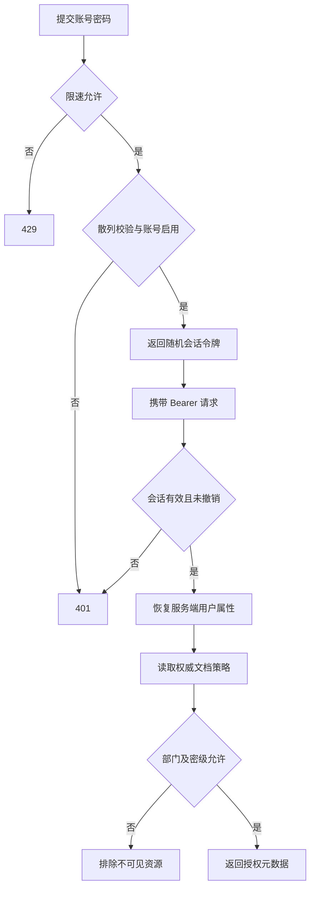

# 认证与权威文档策略 API

## 范围

已实现登录、退出、当前用户、管理员创建与修改账号、版本化文档权限更新和授权文档列表。
受保护问答、引用重查、文档上传发布与多源诊断端点均已存在于 app/api/server.py；自主工具调用与多轮任务尚未实现。

## 本地启动

在项目根目录 PowerShell 中执行：

```powershell
.\.venv\Scripts\python.exe -m pip install -r requirements-api.txt
.\.venv\Scripts\python.exe -m scripts.init_access
.\.venv\Scripts\python.exe -m uvicorn app.api.server:app --host 127.0.0.1 --port 8000 --workers 1
```

初始化脚本交互输入管理员密码，不打印、不放进命令参数。默认数据库 data/access.sqlite3，与 Day 3 业务数据库分开。
第一次初始化创建 users/sessions/documents/audit_events；再次初始化保留已存在数据。账号重名报错，不覆盖已有密码。
服务启动不自动初始化账号或数据库，不内置默认密码。当前 HTTP 命令只绑定本机，Windows 客户端连接仍需受信任的 HTTPS。
API 可用 ACCESS_DATABASE_PATH 环境变量选择专用权限库；初始化脚本的 --database 必须使用相同位置。

## 接口

| 方法 | 路径 | 权限 |
| --- | --- | --- |
| GET | /health/live | 无用户信息，仅存活 |
| GET | /health/ready | 管理员，仅检查认证/策略数据库 |
| POST | /api/v1/auth/login | 账号密码，受限速 |
| POST | /api/v1/auth/logout | 当前 Bearer 会话 |
| GET | /api/v1/me | 当前 Bearer 会话 |
| POST | /api/v1/admin/users | 管理员 |
| PATCH | /api/v1/admin/users/{user_id} | 管理员 |
| PATCH | /api/v1/admin/documents/{document_id}/policy | 管理员 |
| GET | /api/v1/documents | 仅返回当前用户可读策略 |

响应含 X-Request-ID 和 Cache-Control: no-store。验证失败不回显输入。文档列表不返回未授权条目。
当前就绪检查只证明认证与策略数据库可用，不证明 Chroma、业务库或模型可用。

## 登录

请求 JSON：
```json
{"username":"你的账号","password":"运行时输入的密码"}
```

成功返回 access_token、token_type、expires_in。后续使用 Authorization: Bearer 令牌。
过期、退出、账号访问范围修改和密码修改后，旧 token 不再有效。

登录限速按客户端地址和账号摘要分别控制；不信任客户端 X-Forwarded-For。
当前是有界内存限速，需要单 worker；多实例或代理部署时必须重新设计可信来源与共享限速。

## 策略更新

请求包含 expected_version 和 policy。新资源 expected_version=0，policy_version=1；已有资源必须递增。
更新与审计在同一写事务中完成；旧版本请求返回 409。缺标签、无效密级和额外字段返回 422。

此接口当前是策略管理基础。索引发布状态机仍待实现，管理端声明 active 并不证明相应文档已经入库，
最终问答必须同时核验索引内容版本，禁止仅依据 active 返回旧正文。

## 会话与候选过滤流程



图中已实现的是认证与策略列表，候选正文检索、模型调用及最终撤权复核后续接入。
# 自助改密码接口补充（2026-09-15）

`POST /api/v1/auth/password` 要求 Bearer 会话，JSON 仅接受 current_password 与 new_password；新密码长度 12–1024。客户端不能指定 user_id，目标账号只能来自当前会话。成功返回 `{"ok":true,"reauthentication_required":true}`，随后客户端应清理会话并重新登录。

服务端校验旧密码后计算新散列，进入写事务时再次检查当前会话、启用状态与 authz_version；密码、版本、全部会话撤销和 user.password 审计一起提交。不记录明文密码。错误旧密码返回统一 401，参数错误返回脱敏 422；使用当前单 worker 限速器限制来源与账号请求。此接口不是忘记密码或管理员重置功能。

新增接口测试覆盖未登录、错误旧密码、伪造目标用户字段、两会话撤销、新旧密码登录结果与审计。账号/API 专项 26 passed（11.39 秒，2 条第三方弃用警告）；客户端表单与真实 HTTPS 操作待验收。以下原有章节按各自记录时点阅读。

