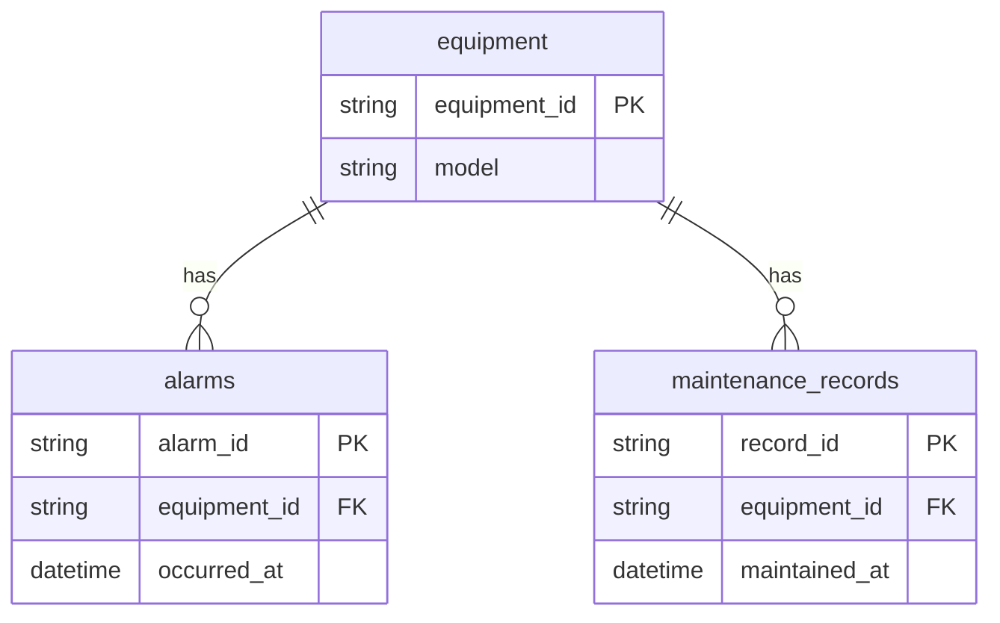

# Day 3 功能报告：结构化运维数据与只读查询

## 状态与范围

已实现 SQLite 三张业务表、可重复初始化的模拟数据、三个固定参数化只读查询、输入校验和数据库错误映射。
本阶段可独立离线运行，不依赖大模型、API Key、Chroma 或网络服务。
Day 2 文档问答保持独立；尚未实现将文档、报警和维修合并的诊断服务。

所有设备资产、报警及处理记录为模拟数据。SIM-* 不是厂商报警代码，记录不代表真实维修或现场操作授权。

## 功能清单

- 查询指定设备基本信息。
- 按设备查询最近报警，可限制条数、过滤级别。
- 按设备查询最近维修/处理记录。
- 未知设备明确报错；已知设备无记录返回空列表。
- 设备号、过滤值、limit 使用 SQL 参数绑定，不接收任意 SQL。
- 业务连接使用 SQLite URI mode=ro 和 query_only，写连接仅用于离线初始化。
- 记录统一 UTC 时间；按时间及稳定 ID 降序，limit 范围为整数 1–50。
- 数据库缺失、锁定、身份/版本不符、数据不合格均返回受控错误与 request_id。
- 种子整包验证后在单事务中建表/upsert；失败回滚，同主键更新，其他记录保留。

## 数据字典

### equipment

| 字段 | 存储类型 | 约束/用途 |
| --- | --- | --- |
| equipment_id | TEXT | 主键，模拟设备编号 |
| name | TEXT | 设备名称 |
| model | TEXT | 对应型号 |
| equipment_type | TEXT | 设备分类 |
| production_line | TEXT | 模拟产线 |
| status | TEXT | active / offline / maintenance |
| installation_date | TEXT | ISO 日期，DTO 校验 |
| source_type | TEXT | simulation |

### alarms

| 字段 | 存储类型 | 约束/用途 |
| --- | --- | --- |
| alarm_id | TEXT | 主键 |
| equipment_id | TEXT | 外键指向 equipment |
| code | TEXT | 模拟代码，未知代码不推断含义 |
| severity | TEXT | info / warning / critical |
| message | TEXT | 模拟事件描述 |
| occurred_at | TEXT | UTC，固定微秒格式 |
| acknowledged | INTEGER | 0/1，是否确认收到 |
| resolved | INTEGER | 0/1，是否解决；与 acknowledged 独立 |
| document_id | TEXT | Day 2 manifest 中的文档引用，由种子程序校验 |
| source_type | TEXT | simulation |

### maintenance_records

| 字段 | 存储类型 | 约束/用途 |
| --- | --- | --- |
| record_id | TEXT | 主键 |
| equipment_id | TEXT | 外键指向 equipment |
| symptom | TEXT | 模拟问题现象 |
| action | TEXT | 模拟核对/登记动作，不是现场许可 |
| result | TEXT | resolved / unresolved / escalated |
| maintained_at | TEXT | UTC，固定微秒格式 |
| document_id | TEXT | manifest 逻辑引用，不是 SQLite 外键 |
| source_type | TEXT | simulation |

两个复合索引：

- idx_alarms_equipment_time：equipment_id、occurred_at DESC、alarm_id DESC。
- idx_maintenance_equipment_time：equipment_id、maintained_at DESC、record_id DESC。

完整 ER 图源：[day3-schema.mmd](day3-schema.mmd)。



## 模拟数据摘要

| 设备 | 型号 | 报警 | 维修/处理 |
| --- | --- | --- | --- |
| EQ-ROBOT-001 | UR3e | 5 | 3 |
| EQ-ROBOT-002 | UR5e | 5 | 3 |
| EQ-ROBOT-003 | IRB 120-3/0.6 | 5 | 3 |
| 合计 | 三台模拟资产 | 15 | 9 |

主种子：data/seed/maintenance.json。独立空历史样例：data/seed/empty_history.json。
主库：data/maintenance.sqlite3，由脚本生成，不提交数据库二进制文件。
日期与 ID 为固定模拟值；document_id 与既有规格摘要及信息升级流程交叉引用，不声明真实故障证据。

## 初始化与查询

在已安装项目依赖的 Python 3.12 环境、项目根目录 PowerShell 执行：

```powershell
& './.venv/Scripts/python.exe' -m scripts.seed_db
& './.venv/Scripts/python.exe' -m scripts.day3_query equipment --equipment-id EQ-ROBOT-001
& './.venv/Scripts/python.exe' -m scripts.day3_query alarms --equipment-id EQ-ROBOT-001 --limit 2 --severity critical
& './.venv/Scripts/python.exe' -m scripts.day3_query maintenance --equipment-id EQ-ROBOT-001 --limit 2
```

初始种子 after 应为 equipment=3、alarms=15、maintenance_records=9；重复运行数量保持不变。
同主键的现有值会更新成种子值，运行前应确认允许更新这些模拟记录。
三个查询方法分别为 MaintenanceRepository.get_equipment、list_recent_alarms、list_maintenance_history。

查询成功返回 `{ok:true, request_id, data}`；失败返回 `{ok:false, request_id, code, message}`。
成功退出码 0，受控失败退出码 1。缺失 CLI 必填参数的用法错误由 argparse 处理。

| 错误码 | 含义 |
| --- | --- |
| INPUT_ERROR | 操作、设备字段、limit 或过滤条件不合法 |
| EQUIPMENT_NOT_FOUND | 设备不存在，不返回其他设备数据 |
| DATABASE_NOT_FOUND | 数据库缺失，读取不会创建空库 |
| DATABASE_BUSY | 数据库锁等待超时，当前等待上限为 1 秒 |
| DATABASE_SCHEMA_ERROR | 应用身份或版本不匹配 |
| DATABASE_ERROR | 数据库读取、损坏或其他 SQLite 错误 |
| DATA_INTEGRITY_ERROR | 已存储记录不符合 DTO |
| SEED_ERROR | 种子校验、未知数据库或文件访问问题 |

## 验证

2026-09-10 在本地 Windows / Python 3.12 环境实际执行：

| 检查 | 结果 |
| --- | --- |
| Day 1–3 全量 pytest | 79 项通过 |
| Day 3 新增 pytest | 39 项（包含在全量中） |
| Day 3 一键验收 | 22/22 |
| Day 2 本地问答回归 | 12/12 |
| 重复初始化 | 3/15/9 保持不变 |
| Ruff、pip check | 通过 |

这些是固定模拟数据集和当前代码的本地结果，不是生产准确率或吞吐性能指标。
本轮未执行 DeepSeek 在线回归，未新增依赖。

复现命令：

```powershell
& './.venv/Scripts/python.exe' -m scripts.seed_db
& './.venv/Scripts/python.exe' -m scripts.run_day3_smoke
& './.venv/Scripts/python.exe' -m pytest tests/integration/test_day3_data.py tests/integration/test_day3_cli.py -q
```

验收脚本将每轮报告独立保存到 docs/evidence/day3，不覆盖历史。
脚本会在临时库故意测试缺库、写锁和只读拒写；对应错误日志是预期负向场景，以最终 passed 与退出码判断。
主库只读。空历史、锁定和写入拒绝实验不会修改主数据库。

## 新增代码结构

```text
app/db/models.py                 三表与索引 DDL
app/db/session.py                只读连接、错误映射与 request_id 日志
app/db/repositories.py           三个固定业务方法
app/db/seed.py                   种子验证与事务 upsert
app/schemas/maintenance.py       请求、DTO、种子结构
app/services/data_service.py     查询结果与错误包装
scripts/seed_db.py               初始化入口
scripts/day3_query.py            查询入口
scripts/run_day3_smoke.py        固定验收入口
data/seed/                       可复现模拟数据
tests/integration/test_day3_*    数据和 CLI 回归测试
```

## 与 Day 2 的关系及限制

- Day 2 是文档语义检索；Day 3 是设备与记录的精确只读查询，两条链路目前独立。
- P0 采用固定参数化方法，不采用任意 Text-to-SQL；当前没有 SQL 文本执行业务入口。
- SQLite 只读连接不是账号权限系统；拥有文件写权限的管理程序仍可写入。
- 种子更新不会删除不在种子包中的旧记录，也不提供清表重建开关。
- 应用标记与 schema 版本用于识别数据库，不是防篡改证明或完整迁移框架。
- 当前不包含记录查询 UI、FastAPI 接口、三源诊断或真实设备控制。

下一阶段按 Day 4 将文档证据、报警与维修记录编排为诊断结果，本报告不将其计为已完成。
