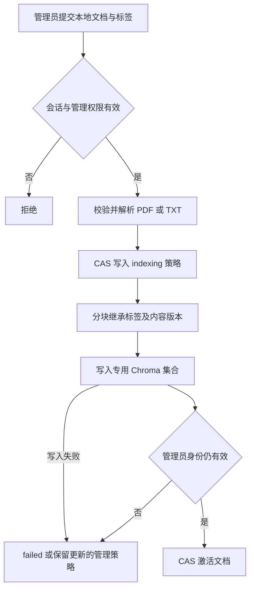
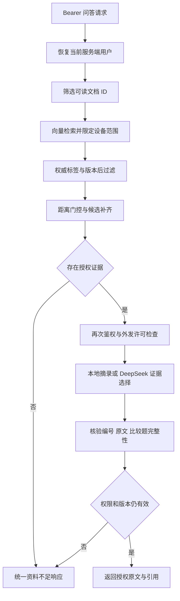

# 受保护文档发布与问答

## 当前实现

- app/ingestion/publication.py：受控本地 PDF/TXT 发布，管理员身份校验、标签继承、内容 SHA256 版本、发布状态。
- app/services/protected_qa.py：统一预过滤、权威后过滤、有界候选补齐、外发许可和最终权限复核。
- POST /api/v1/ask：只接受有效登录会话；客户端不能提交角色或部门覆盖身份。
- GET /api/v1/documents/{document_id}/chunks/{chunk_id}：重新检查文档权限、片段归属和版本。
- scripts/publish_document.py：交互认证的本地发布命令。

当前已有管理/验收网页、设备/报警/维修鉴权及固定多源诊断，详见 README 与 app/api/server.py。
旧 Day 2 CLI 与 Streamlit 是历史开发入口，不受新 HTTP 身份层保护，不可对外部署。
线上必须使用 app.api.server:app 的受保护入口。

## 发布步骤

先按 auth-api.md 初始化权限数据库与管理员账号；BGE 模型沿用现有项目准备方法。

示例为明确标注的模拟资料，部门和密级由管理员确认：

```powershell
.\.venv\Scripts\python.exe -m scripts.publish_document --file data/raw_docs/manuals/ur3e_summary.txt --document-id UR3E-SUMMARY --department A --classification 1 --equipment-id EQ-ROBOT-001 --expected-version 0 --allow-external
```

--allow-external 仅用于已获允许外发的模拟资料；缺省禁止发送给 DeepSeek。
新发布策略经过 indexing 再 active，因此新资源成功后的 policy_version 为 2。
更新时 --expected-version 使用当前真实策略版本，版本不符拒绝覆盖。
内容版本从文件 SHA256 生成，不信任上传者声明。
新索引集合为 authorized_v1，与 day2_semantic_v1 分离，不自动授予旧文档权限。

第一版采用发布期间暂停访问：索引成功才激活，失败进入 failed。
旧版本块暂留索引，但因内容/权限版本不匹配不能通过后过滤。
管理界面修改权限版本后也会使旧块失效，需要按新策略重新发布才能恢复问答。

## 发布流程



解析失败发生在策略切换前，不会把原有可读版本标为成功更新。
SQLite 与 Chroma 不提供跨库事务，本实现通过不可读中间状态避免发布部分索引。

## 问答流程



尚未增加自由文本生成；沿用证据选择模式，输出由服务端恢复原文。
候选正文不写入普通 trace。不能在引用被删除后保留由其生成的答案。
认证失效返回 401；资料不足返回 grounded=false。引用不存在与无权访问统一为 404。
当前采用返回前重新检查的撤权语义，最终检查之后极短的并发时隙尚无全局锁排序保证。

## 验证覆盖

新增测试使用真实本地 Chroma 与 hash 向量验证访问控制，模型用受控选择器替身；
因此证明权限路径，不能替代 BGE 召回质量或真实 DeepSeek 端到端验收。

已覆盖：跨部门、空允许列表、索引忽略预过滤、禁止外发、残留旧块、
发布失败、非管理员发布、模型等待期间撤权、未知输出编号、
未登录问答、客户端伪造身份及引用访问时下线。

仍需补充：真实 BGE 权限语料回归、在线模拟资料回归、并发发布、上传资源限制、
统一登录与三源诊断已存在；Windows 联调及专项权限检查以实际执行证据为准。

