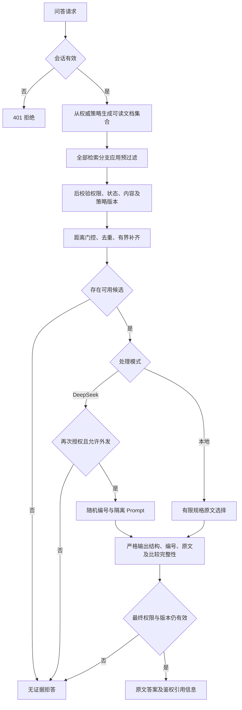
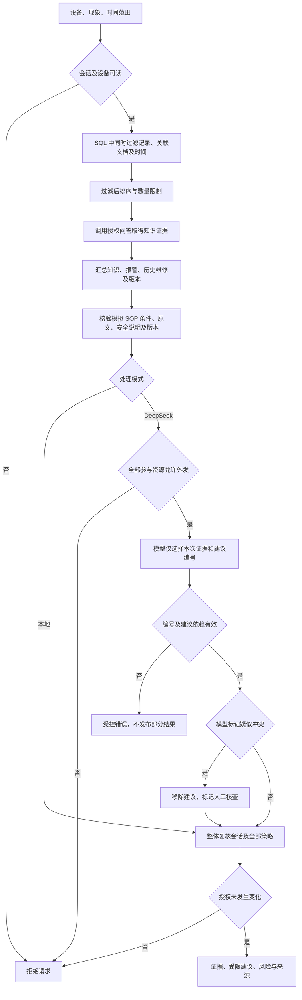
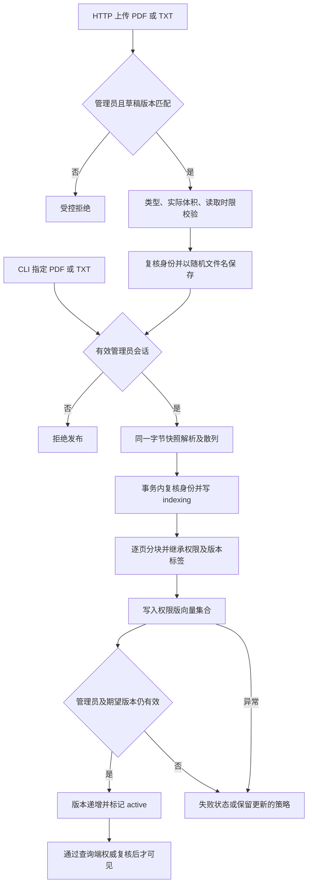

# 系统流程示意图

当前实现说明，不是完整交付证明。依据 app/api/server.py、protected_qa.py、diagnosis_service.py、publication.py 的执行链路。Mermaid 源码可在支持 Mermaid 的 Markdown 查看器中显示；本次尚未执行图形渲染验收。

当前范围：后端与 Windows 客户端，网页保留作管理和回归入口。Android 不列入当前交付。下图只说明已有固定流程。

## 授权问答

会话在途失效可直接返回 401；模型/数据库故障经 API 返回受控错误，不把失败正文拼成答案。未授权候选在模型、客户端响应及普通正文日志之前被过滤。图中“无证据拒答”与“系统错误”不是同一种内部原因。

## 三源辅助诊断

知识选择与三源选择可能分别调用模型。读取许可不等于外发许可。历史维修只作历史证据；目前建议仅支持现有模拟 SOP 的信息登记、补充手册和人工升级，不提供设备操作授权。疑似冲突是模型标记，不是服务端证明的事实；grounded=false 不宣称根因已经确认。

## 文档上传与发布

发布失败不放开读取；不能依赖旧向量已删除来保证下线。HTTP 失败时清理该请求创建的原件；成功原件仅留在服务端，无静态下载接口。HTTP 上传已通过模拟文件接口测试，真实 HTTPS、解析器进程级资源限制仍未验收。图中上传校验、文件保存或解析失败也会提前退出，不进入 active。

## 客户端与部署状态

以下为延后范围及运行环境说明，不把未完成客户端作为 Agent 已完成的依据，也不再把安装包作为本次完成条件。

| 部分 | 当前状态 |
| --- | --- |
| Flutter 登录、问答、设备、诊断、引用页面 | 源码已写，未编译和运行 |
| HTTPS、退出清理、旧响应隔离、回前台复核 | 源码已写，端到端未验证 |
| 平台安全存储、管理员页、完整筛选分页 | 未完成 |
| 后端启动入口 | 本机存活与未登录拒绝已实测 |
| 可信 HTTPS、Windows 安装包、签名 APK | 未完成 |
| 干净 Windows 环境 | 未验收 |

以上流程图不会证明所有安全输入均被覆盖。模型输出格式、授权语义、并发撤权、日志、部署和客户端需要分别验收。
